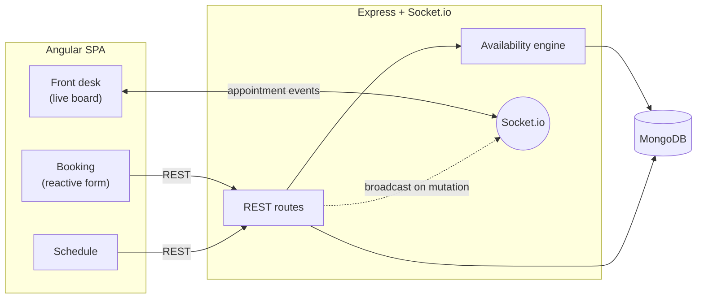

# Frontdesk

Real-time appointment scheduling and front-of-house operations for service businesses — a full-stack TypeScript application on the MEAN stack (MongoDB, Express, Angular, Node.js) with live updates over WebSockets.


**Live demo:** _add your Render URL_ · **Source:** _add your GitHub URL_

---

## Overview

Frontdesk models the day-to-day reality of an appointment-based business — a spa, salon, or clinic — across three connected surfaces:

- A **customer booking flow** that only ever offers genuinely open times, computed live against existing appointments.
- A **front-of-house console** where staff move appointments through their lifecycle and the board stays in sync across every open device in real time.
- A **daily schedule** grouped by provider.

The interesting problems here are not CRUD. They are *interval scheduling* (which times are actually free?), *concurrency* (what happens when two customers race for the last slot?), and *distributed UI state* (how does one staff member's action reach every other screen instantly?). The sections below describe how each is handled.

---

## Architecture



The client is a thin, typed view over a REST API. Reads and writes go over HTTP; the only thing that flows over the socket is change notification. When any appointment is created or transitions state, the server broadcasts an event and every connected board re-reads authoritative state — so the UI is always a reflection of the database, never a guess.

---

## Engineering notes

### Availability is an interval-scheduling problem

`getAvailableSlots` treats the day as a series of candidate start times across business hours and keeps only those that can fit the requested duration without colliding with an existing appointment for that provider. Conflict detection reduces to a single, well-known predicate:

```
two intervals overlap  ⟺  aStart < bEnd  AND  aEnd > bStart
```

Each provider's appointments for the day are loaded **once**, up front, and reused across every candidate slot — avoiding a per-slot query (an N+1 trap). Cancelled and no-show appointments are excluded from the conflict set, so abandoned bookings correctly release their time back into availability.

### Double-booking is a concurrency problem, not just a UI one

Availability is *advisory* — true only at the moment it's read. Between a customer seeing a slot and submitting it, someone else may take it. The authoritative defense lives at the write boundary: the booking route re-checks for an overlapping appointment immediately before inserting and returns `409 Conflict` if the slot is gone.

This narrows the race window substantially but is, deliberately, a documented limitation rather than an overclaim: a check-then-insert is not atomic, so under genuine simultaneous load two requests could still both pass the check. The airtight fix — a unique partial index on the provider/time interval, or a transaction — is noted under [next steps](#possible-extensions). Calling this out is intentional; knowing where a guard's guarantees end matters more than pretending they don't.

### The appointment lifecycle is a finite state machine

Appointments move through `booked → checked_in → in_service → completed`, with branch transitions to `cancelled` and `no_show`. Responsibility is split cleanly: the **server** owns validity (a transition target must be a known status) while the **client** owns which transitions it offers in context (e.g. "No-show" only appears before service begins). Terminal branches feed back into the availability engine, closing the loop between operations and scheduling.

### Data modeling: reference, don't embed

An `Appointment` references `Service` and `Provider` by `ObjectId` rather than embedding them. Those entities are shared across many appointments and change independently of any single booking, so normalizing keeps writes cheap and avoids stale duplication. A compound index on `{ provider, start, end }` directly serves the windowed query the availability engine runs most often.

### Types end to end

The same domain shapes are declared once and shared across the boundary: Mongoose schemas derive their types via `InferSchemaType`, and the Angular client mirrors the API contract with explicit interfaces, so a change to the data shape surfaces as a compile error rather than a runtime surprise.

### Real-time without optimistic drift

The front-desk board never mutates local state on an action and hopes the server agrees. It fires the mutation, and the resulting broadcast triggers a re-read for *every* client — including the one that initiated it. There is exactly one source of truth, and concurrent staff never diverge.

---

## Tech stack

| Layer        | Choices                                                              |
|--------------|---------------------------------------------------------------------|
| Frontend     | Angular (standalone components, reactive forms, modern control flow), RxJS, TypeScript |
| Realtime     | Socket.io client                                                    |
| Backend      | Node.js, Express, TypeScript                                        |
| Data         | MongoDB with Mongoose ODM                                           |
| Realtime     | Socket.io server                                                    |
| Delivery     | MongoDB Atlas, Render (web service + static site)                  |

---

## API

| Method | Endpoint                          | Purpose                                   |
|--------|-----------------------------------|-------------------------------------------|
| `GET`  | `/api/services`                   | List bookable services                    |
| `GET`  | `/api/providers`                  | List active providers                     |
| `GET`  | `/api/availability`               | Open slots for `?serviceId=&date=`        |
| `POST` | `/api/appointments`               | Create a booking (with conflict guard)    |
| `GET`  | `/api/appointments?date=`         | Appointments for a day                    |
| `PATCH`| `/api/appointments/:id/status`    | Transition an appointment's state         |

Mutations on `/api/appointments` emit `appointment:created` / `appointment:updated` over Socket.io.

---

## Data model

```
Service     { name, durationMinutes, price }
Provider    { name, active }
Appointment { customerName, customerPhone,
              service → Service, provider → Provider,
              start, end, status, notes }
              status ∈ booked | checked_in | in_service | completed | cancelled | no_show
              index: { provider, start, end }
```

---

## Running locally

**Prerequisites:** Node.js 18+, a MongoDB connection string (local or Atlas), and the Angular CLI.

**Backend**

```bash
cd backend
cp .env.example .env          # set MONGO_URI
npm install
npm run seed                  # load sample services + providers
npm run dev                   # http://localhost:4000
```

**Frontend**

```bash
cd frontend
npm install
ng serve                      # http://localhost:4200
```

To see real-time sync in action, open the front-desk board in two windows and advance an appointment in one.

---

## Deployment

The backend runs as a Render web service (`npm run build` → `npm start`) against a MongoDB Atlas cluster; the frontend is an Angular production build served as a Render static site with a SPA rewrite to `index.html`. API and socket origins are configured per-environment, and CORS is pinned to the deployed client origin.

---

## Possible extensions

These are deliberately out of scope for a focused build, listed in roughly the order they'd matter:

- **Atomic booking** — enforce the no-overlap invariant with a unique partial index or a transaction, eliminating the residual write-race entirely.
- **Per-provider working hours** and breaks, instead of a single shared business day.
- **Authentication and roles** — separate the public booking surface from the staff console.
- **Customer accounts**, history, and SMS/email reminders.
- **Recurring appointments** and waitlists.
- **Test coverage** — unit tests around the overlap predicate and state-transition rules, where the logic is densest.

---

## Project structure

```
.
├── backend/
│   └── src/
│       ├── server.ts            # Express + Socket.io bootstrap
│       ├── db.ts  socket.ts     # connection + event broadcast
│       ├── models/              # Service, Provider, Appointment
│       ├── lib/availability.ts  # slot generation + conflict detection
│       ├── routes/              # services, providers, availability, appointments
│       └── seed.ts
└── frontend/
    └── src/app/
        ├── booking/             # multi-step reactive form
        ├── frontdesk/           # live operations board
        ├── schedule/            # day view by provider
        ├── api.service.ts       # typed REST client
        └── realtime.service.ts  # socket stream as an Observable
```
